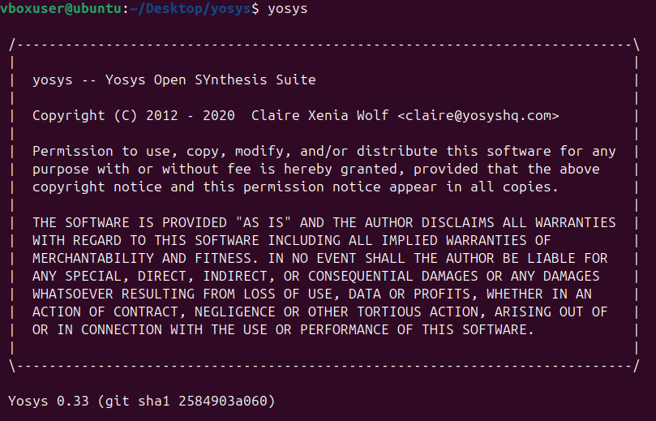
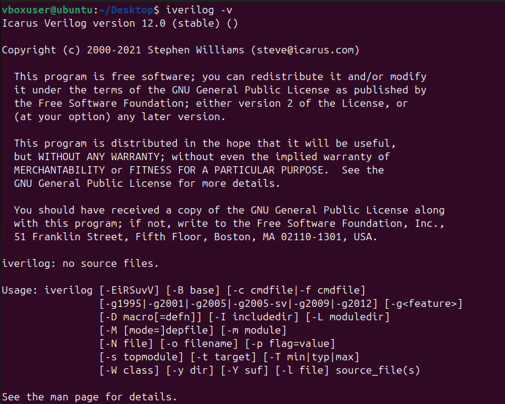
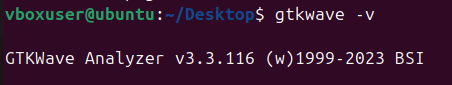

# RISC-V-Reference-SoC-Tapeout-Program
This repository contains my weekly updates of "RISC‑V Reference SoC Tapeout Program". The topics are organized by weekly, and you can click on each heading to expand and see more details.
## Week 0 - Toosl installation


## Yosys

```bash
$ git clone https://github.com/YosysHQ/yosys.git
$ cd yosys 
$ sudo apt install make (If make is not installed please install it) 
$ sudo apt-get install build-essential clang bison flex \
    libreadline-dev gawk tcl-dev libffi-dev git \
    graphviz xdot pkg-config python3 libboost-system-dev \
    libboost-python-dev libboost-filesystem-dev zlib1g-dev
$ make 
$ sudo make install
```

## Iverilog

```bash
$ sudo apt-get install iverilog
```

## GTKWave

```bash
$ sudo apt update
$ sudo apt install gtkwave
```

