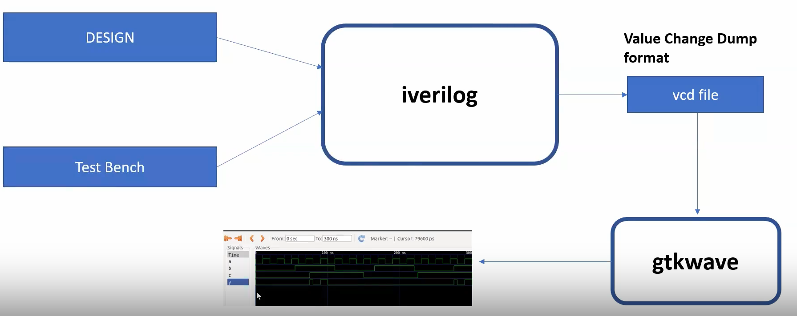
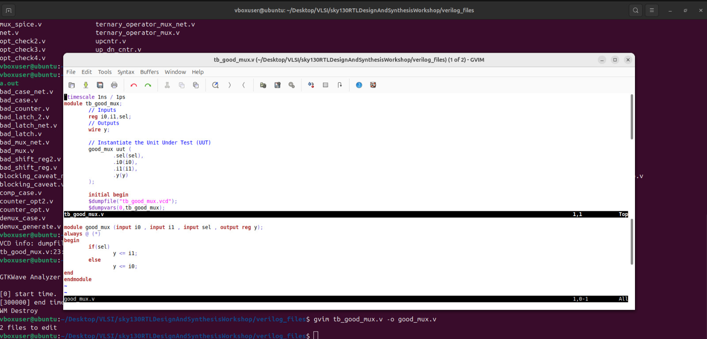
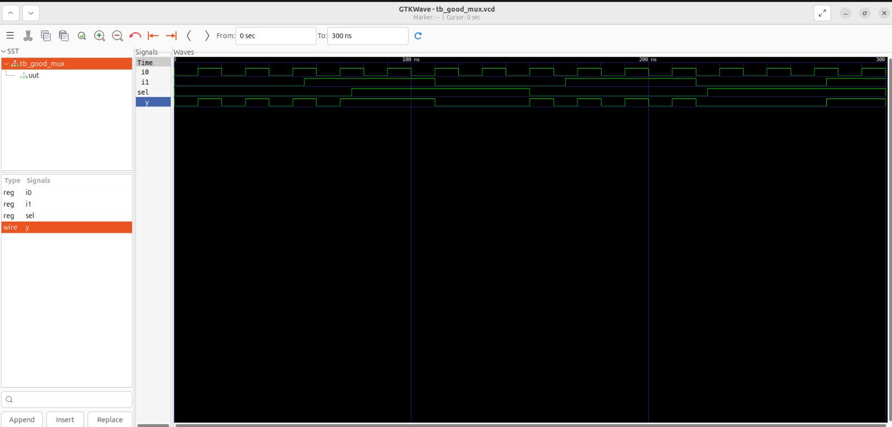
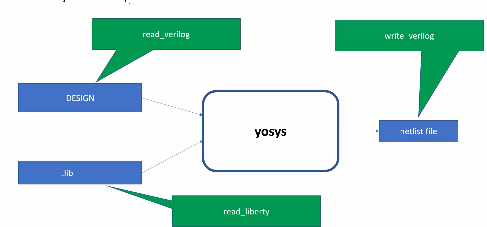
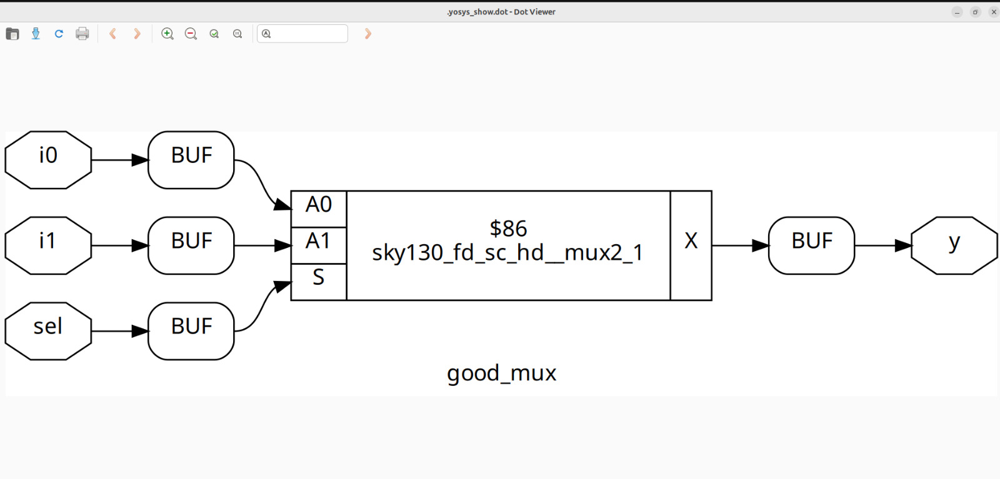
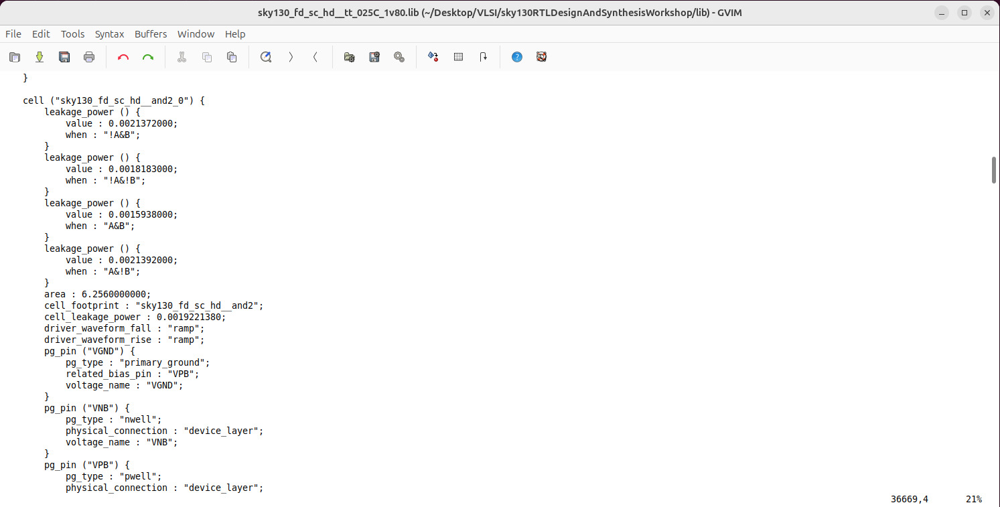
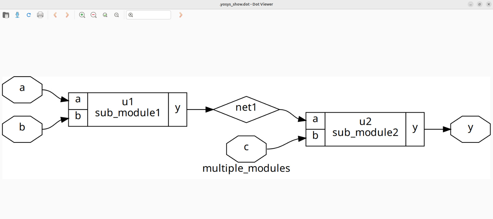

# RISC-V-Reference-SoC-Tapeout-Program
This repository contains my documentaion of "RISC‑V Reference SoC Tapeout Program". The topics are organized weekly and you can click on each heading to expand and see more details.
<details>
<summary><b>Week 0 - Tools Installation</b></summary>
<br>
    
# Week 0 - Tools installation

## Yosys

<ul>
    <li>Yosys is an open source tool for verilog RTL synthesis.</li>
    <li>It takes verilog code and translates to detailed netlist.</li>
</ul>

```bash
$ git clone https://github.com/YosysHQ/yosys.git
$ cd yosys 
$ sudo apt install make (If make is not installed please install it) 
$ sudo apt-get install build-essential clang bison flex \
    libreadline-dev gawk tcl-dev libffi-dev git \
    graphviz xdot pkg-config python3 libboost-system-dev \
    libboost-python-dev libboost-filesystem-dev zlib1g-dev
$ make 
$ sudo make install
```


## Iverilog

<ul>
    <li>Icarus Verilog (iverilog) is a free and open-source software tool for simulating and synthesizing hardware designs written in the Verilog HDL.</li>
</ul>

```bash
sudo apt-get update
sudo apt-get install iverilog
```


## GTKWave

<ul>
    <li>GTKWave is a free, and open-source waveform viewer used for analyzing the results of digital circuit simulations.</li>
</ul>

```bash
$ sudo apt update
$ sudo apt install gtkwave
```


</details>

<details>
<summary><b>Week 1 -Synthesis & GLS</b></summary>
<br>
    
# Week 1 - Synthesis & GLS
<details>
<summary><b>Day 1 -Introduction to Verilog RTL Desgin and Synthesis</b></summary>
<br>
<h> 
    
## 1. Introduction to  open source simulator - iverilog    
</h>

 
<ul>
    <li>Design and Test bench are written in Verilog code</li>
    <li>A Verilog testbench is a separate Verilog module designed to verify the functional correctness of a digital design</li>
    <li>A vcd file is generated by iverilog, this can be graphicaly seen wtih the help of gtk wave</li>
</ul>
<h>
    
## 2. Lab using iverilog and gtkwave     
</h>

1. clone the workshope repository

```bash
git clone https://github.com/kunalg123/sky130RTLDesignAndSynthesisWorkshop.git
cd sky130RTLDesignAndSynthesisWorkshop/verilog_files
```

2. Verilog code for 2to1 mux 



3. Compile design and test bench:

```bash
iverilog good_mux.v tb_good_mux.v
```
4. Run the simulation:

```bash
./a.out
```
5. view waveform:

```bash
gtkwave tb_good_mux.vcd
```


<h>
    
## 3. Introduction to yosys and logic synthesis
</h>



<ul>
    <li>RTL design - Behavioral representation of the required specification</li>
    <li>Synthesis - RTL to Gate level translation</li>
    <li>'.lib' - Collection of logical modules</li>
    <li>Netlist - A gate-level description of a design's logical structure, detailing the interconnections (nets) between standard logic cells (gates, flip-flops) that implement the design's functionality</li>
</ul>

<h>

## 4. Lab using Yosys and Sky130PDK
</h>

1. Start yosys

```bash
yosys
```
2. Read Library:

```bash
read_liberty -lib /lib/sky130/file/sky130_fd_sc_hd__tt_025C_1v80.lib
```
3. Read verilog code

```bash
read_verilog good_mux.v
```
4. Synthesize the design

```bash
synth -top good_mux
```
5. Technology mapping

```bash
abc -liberty /lib/sky130/file/sky130_fd_sc_hd__tt_025C_1v80.lib
```
6. Viewing gate level netlist

```bash
show
```



<h>

## 5. Summary
</h>

<ul>
    <li>Learned about test bench, simulators and logic synthesis</li>
    <li>Learned how to manage missing module errors in linux terminal</li>
    <li>Understood the use of faster and slower cells</li>
</ul>


</details>
<details>
<summary><b>Day 2 -Timing libs,hierarchical vs flat synthesis and efficient flop coding style</b></summary>

 <h>

## 1. Introduction to timing libs
</h>
The Sky130 Process Design Kit (PDK), an open-source platform for integrated circuit design, provides a comprehensive suite of timing libraries essential for static timing analysis (STA). These libraries, provided in the industry-standard Liberty (.lib) format, contain detailed information about the performance of the standard cells under various operating conditions. This allows designers to accurately predict and verify the timing of their digital circuits before manufacturing.



<h>
    
## 2. Hierarchical vs. Flattened Synthesis
</h>

<ul>
    <ls>Hierarchical synthesis respects the boundaries of the modules defined in the Verilog code. Each module is synthesized as a separate entity, and the overall design is then constructed by connecting these synthesized sub-modules. This approach mirrors the structured and modular way designers often write their code, breaking down a complex system into smaller, manageable blocks.</ls>
    
    
    <ls>flat synthesis dissolves these modular boundaries. The synthesis tool takes the entire design and "flattens" it into a single, large module. This process effectively exposes all the logic to the synthesis tool at once, allowing for optimizations across the entire design without being constrained by the original module partitions.</ls>
    
</ul>

<h>

## 3. Flops coding styles and optimization

</h>
if we use only combinational circuits to design a system then the output will not settle, it will show glitches. To avoid this we use flops. Flops gives stable outputs and eliminates glitches.
<br>
1. Asynchronous Reset D Flip-Flop

```bash 
module dff_asyncres (input clk, input async_reset, input d, output reg q);
  always @ (posedge clk, posedge async_reset)
    if (async_reset)
      q <= 1'b0;
    else
      q <= d;
endmodule
```

2. Asynchronous Set D Flip-Flop

```bash
module dff_async_set (input clk, input async_set, input d, output reg q);
  always @ (posedge clk, posedge async_set)
    if (async_set)
      q <= 1'b1;
    else
      q <= d;
endmodule
```

3. Synchronous Reset D Flip-Flop

```bash
module dff_syncres (input clk, input async_reset, input sync_reset, input d, output reg q);
  always @ (posedge clk)
    if (sync_reset)
      q <= 1'b0;
    else
      q <= d;
endmodule
```


</details>

