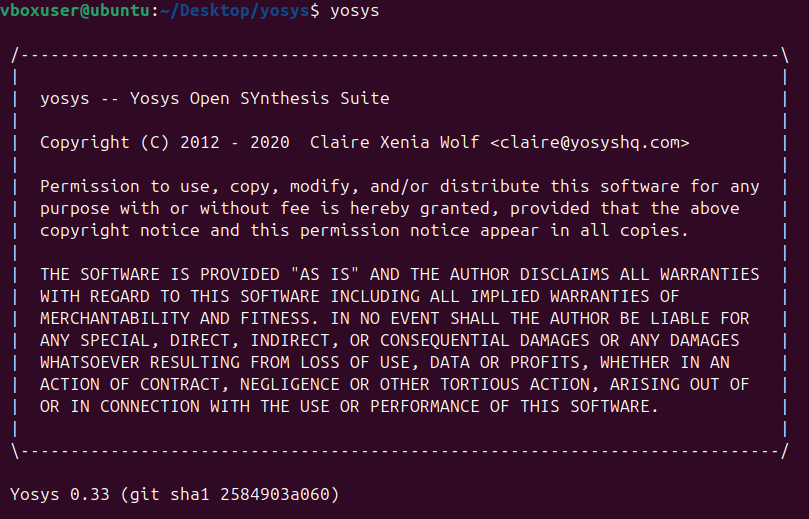
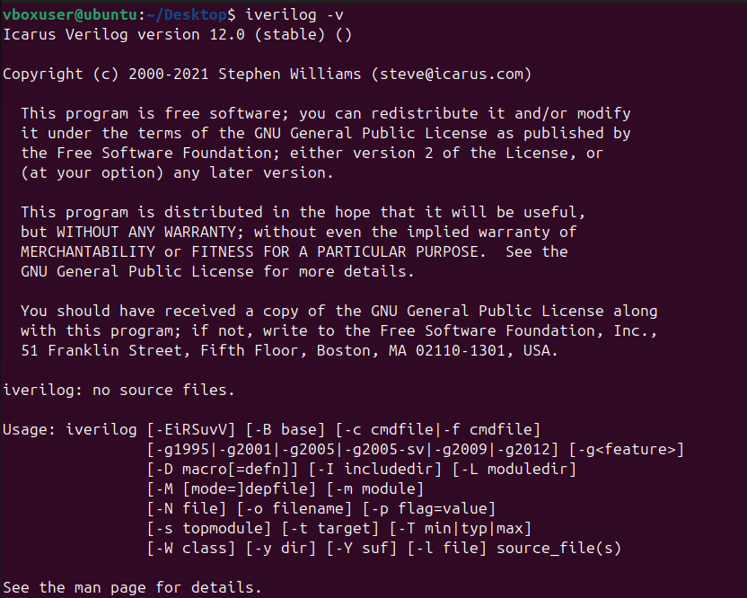
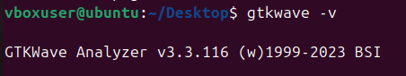

# RISC-V-Reference-SoC-Tapeout-Program
This repository contains my documentaion of "RISC‑V Reference SoC Tapeout Program". The topics are organized weekly and you can click on each heading to expand and see more details.
<details>
<summary><b>Week 0 - Tools Installation</b></summary>
<br>
    
# Week 0 - Tools installation

## Yosys

<ul>
    <li>Yosys is an open source tool for verilog RTL synthesis.</li>
    <li>It takes verilog code and translates to detailed netlist.</li>
</ul>

```bash
$ git clone https://github.com/YosysHQ/yosys.git
$ cd yosys 
$ sudo apt install make (If make is not installed please install it) 
$ sudo apt-get install build-essential clang bison flex \
    libreadline-dev gawk tcl-dev libffi-dev git \
    graphviz xdot pkg-config python3 libboost-system-dev \
    libboost-python-dev libboost-filesystem-dev zlib1g-dev
$ make 
$ sudo make install
```



## Iverilog

<ul>
    <li>Icarus Verilog (iverilog) is a free and open-source software tool for simulating and synthesizing hardware designs written in the Verilog HDL.</li>
</ul>

```bash
sudo apt-get update
sudo apt-get install iverilog
```



## GTKWave

<ul>
    <li>GTKWave is a free, and open-source waveform viewer used for analyzing the results of digital circuit simulations.</li>
</ul>

```bash
$ sudo apt update
$ sudo apt install gtkwave
```



<summary><b>Week 1 -Synthesis & GLS</b></summary>
<br>
    
# Week 1 - Synthesis & GLS
